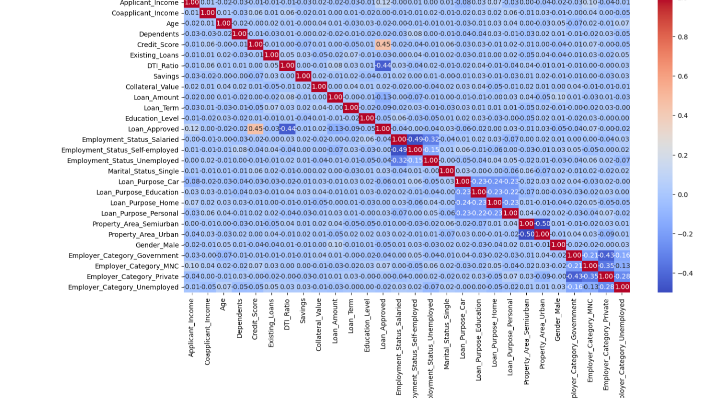

# CreditWise - Loan Approval Prediction System

## Overview

CreditWise is a Machine Learning project that predicts loan approval outcomes based on applicant financial and demographic information.

## Objectives

- Analyze applicant data
- Identify factors affecting loan approval
- Build predictive ML models
- Compare model performance

## Technologies Used

- Python
- Pandas
- NumPy
- Matplotlib
- Seaborn
- Scikit-Learn
- Jupyter Notebook

## Project Workflow

1. Data Cleaning
2. Missing Value Handling
3. Exploratory Data Analysis (EDA)
4. Feature Engineering
5. Data Preprocessing
6. Model Training
7. Model Evaluation

## Models Implemented

- Logistic Regression
- K-Nearest Neighbors (KNN)
- Gaussian Naive Bayes

## Evaluation Metrics

- Accuracy
- Precision
- Recall
- F1 Score
- Confusion Matrix

## Visualizations

### Correlation Heatmap

### Distribution Analysis

### Confusion Matrix

## Key Learnings

- Applied end-to-end Machine Learning workflow.
- Performed feature engineering and preprocessing.
- Compared multiple classification models.
- Gained practical experience with model evaluation and interpretation.

## Author

Developed independently as a Data Science and Machine Learning project using Jupyter Notebook.
